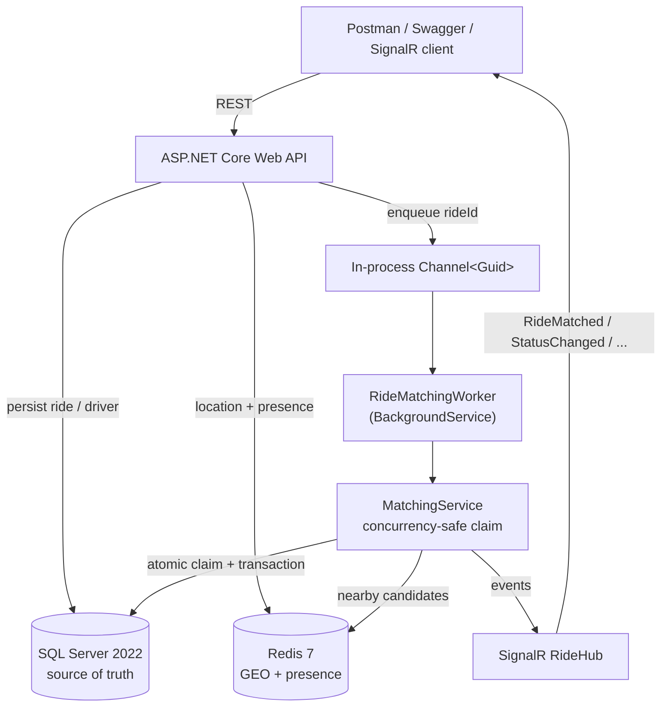

# Real-Time Ride Matching System

A production-minded backend that matches riders to nearby drivers in real time. Riders request rides, drivers go online and stream their location, and a background worker performs concurrency-safe nearest-driver matching. **Redis discovers nearby drivers, SQL Server authoritatively claims them, and SignalR notifies clients.**

Built as a **modular monolith** on .NET 10 / ASP.NET Core.

---

## Overview

The core responsibility split is deliberate and preserved throughout the code:

| Concern | Owner |
| --- | --- |
| Authoritative state (rides, driver status, assignments, audit) | **SQL Server** |
| Fast, frequently-changing hot data (location, presence, nearby search) | **Redis** |
| Asynchronous matching | **BackgroundService + `Channel<T>`** |
| Real-time client updates | **SignalR** |
| API surface | **ASP.NET Core Web API** |
| Persistence access | **EF Core** |

> Redis answers *"which drivers are nearby?"*. SQL Server answers *"can this driver actually be assigned?"*. Redis is never the final assignment authority.

---

## Architecture



---

## Technology Stack

- C# / .NET 10 / ASP.NET Core Web API
- Entity Framework Core 10 (SQL Server provider)
- Microsoft SQL Server 2022
- Redis 7 (StackExchange.Redis, GEO commands)
- SignalR
- `BackgroundService` + `System.Threading.Channels`
- Swagger / OpenAPI (Swashbuckle)
- xUnit + FluentAssertions
- Docker Compose

---

## Project Structure

```
RideMatchingSystem/
├── src/RideMatching.Api/
│   ├── Controllers/         DriversController, RidesController
│   ├── Data/                AppDbContext, DbSeeder, Migrations/
│   ├── Domain/
│   │   ├── Entities/        Driver, Ride, RideAssignment
│   │   ├── Enums/           DriverStatus, RideStatus
│   │   ├── RideStateMachine.cs, GeoCoordinates.cs, Exceptions.cs
│   ├── DTOs/                DriverDtos, RideDtos (records)
│   ├── Services/            DriverService, RideService, MatchingService, RedisLocationService
│   ├── Background/          IRideMatchingQueue, RideMatchingQueue, RideMatchingWorker
│   ├── Hubs/                RideHub, IRideNotifier, SignalRRideNotifier
│   ├── Middleware/          ExceptionMiddleware
│   ├── Configuration/       MatchingOptions, RedisOptions
│   ├── Program.cs, appsettings.json
├── tests/RideMatching.Tests/
│   ├── GeoCoordinatesTests, RideStateMachineTests
│   ├── MatchingServiceTests, ConcurrencyTests
│   ├── SqliteTestDatabase, TestDoubles
├── docker-compose.yml
├── RideMatching.postman_collection.json
└── README.md
```

---

## System Flow

1. `POST /api/drivers` creates a driver (starts `Offline`).
2. `POST /api/drivers/{id}/online` sets `Available` and initializes Redis presence.
3. `POST /api/drivers/{id}/location` updates SQL Server, the Redis GEO index, and refreshes presence TTL.
4. `POST /api/rides` persists the ride, transitions it to `Matching`, enqueues the ride id, and returns **immediately** (HTTP 201).
5. `RideMatchingWorker` dequeues the id and runs `MatchingService.MatchAsync`.
6. Matching queries Redis for nearby candidates, then claims one atomically in SQL Server.
7. On success the ride becomes `Matched`, an assignment row is written, and SignalR notifies clients. If no candidate can be claimed the ride becomes `NoDriverAvailable`.

---

## Database Design

Three tables, all with UTC timestamps.

- **Drivers** — `Id, Name, Status, Latitude, Longitude, LastSeenAt, CreatedAt`. Indexes on `Status`, `LastSeenAt`.
- **Rides** — `Id, RiderId, Pickup*/Destination* coords, Status, DriverId (FK), CreatedAt, MatchedAt, IdempotencyKey`. Indexes on `Status`, `DriverId`, `CreatedAt`, plus a **unique filtered index** on `IdempotencyKey`.
- **RideAssignments** — `Id, RideId (FK), DriverId (FK), AttemptNumber, AssignedAt, Success`. Indexes on `RideId`, `DriverId`. This is the audit trail of every claim attempt (successful and failed).

Enums are stored as `int`. Access is exclusively through EF Core (parameterized), so there is no string concatenation of SQL and no injection surface. Read-only queries use `AsNoTracking()`.

---

## Redis Design

- **GEO index** `drivers:geo` — `GEOADD` on every location update for online drivers; `GEOSEARCH` (circle, ascending distance) returns nearest-first candidates.
- **Presence** `driver:presence:{driverId}` — short-lived key with a configurable TTL (default 30s), refreshed on each location update. Absence implies the driver went quiet.

All Redis keys, radius, candidate cap, and TTL come from configuration (`MatchingOptions`) — nothing is hard-coded.

---

## Matching Algorithm

`MatchingService.MatchAsync(rideId)`:

1. Load the ride. If it is not in `Matching`, stop safely.
2. `GEOSEARCH` Redis within the configured radius, capped at `MaxCandidates`, nearest-first.
3. If there are no candidates → mark `NoDriverAvailable`.
4. For each candidate in order: verify presence, then attempt the atomic SQL claim.
5. On a winning claim → update the ride, write a successful `RideAssignment`, commit, then (outside the transaction) clean up Redis and notify via SignalR. Done.
6. On a failed claim → record a failed attempt and try the next candidate.
7. If all candidates fail → mark `NoDriverAvailable`.

There is no unbounded retry loop; the candidate list is finite.

---

## Concurrency Handling

Two rides may discover the same driver through Redis at the same moment — that is expected. Only one may win.

The claim is **not** a read-then-write (`select → check → update`), which would race. Instead it is a single atomic conditional update, executed via EF Core `ExecuteUpdateAsync` inside a short SQL transaction:

```sql
UPDATE Drivers
SET Status = 'Busy'
WHERE Id = @DriverId
  AND Status = 'Available';
```

The **affected row count** is the decision:

- `1 row` → this ride won the driver.
- `0 rows` → someone else already took it (or it went offline/busy); try the next candidate.

The transaction wraps exactly six steps and nothing else:

1. Driver `Available → Busy` (the conditional update).
2. Re-check the ride is still `Matching` (release the driver if not).
3. Ride `Matching → Matched`.
4. Set `Ride.DriverId`.
5. Set `MatchedAt`.
6. Insert the `RideAssignment` row, then commit.

**No Redis or SignalR calls happen while the transaction is open** — those run after commit. On any error the transaction rolls back.

This is covered by an automated test (`ConcurrencyTests`) that runs two matching operations concurrently against a real relational database, each on its own connection/transaction, and asserts exactly one ride wins, the driver ends `Busy`, the loser becomes `NoDriverAvailable`, and only one successful assignment row exists.

---

## Background Processing

Ride creation enqueues a `Guid` onto an in-process `Channel<Guid>` (`RideMatchingQueue`, a singleton). `RideMatchingWorker` (a `BackgroundService`) reads the channel and processes each ride in its own DI scope. It:

- supports cancellation and shuts down gracefully,
- logs processing,
- retries transient failures (bounded, with backoff),
- catches exceptions per-ride so **one bad ride never terminates the worker**.

> For a single-instance assessment deployment, an in-process `Channel<T>` is used intentionally. In a multi-instance production environment this queue would be replaced with a durable distributed broker (with a dead-letter queue).

---

## Real-Time Communication

SignalR hub at `/hubs/rides`. Clients join groups: `ride:{rideId}`, `rider:{riderId}`, `driver:{driverId}`.

Events: `RideMatched`, `RideStatusChanged`, `DriverAssigned`, `DriverLocationUpdated`, `NoDriverAvailable`.

Business logic lives in services, not the hub. A thin `IRideNotifier` abstraction (`SignalRRideNotifier`) fans events to the right groups and swallows transport failures so committed state is never rolled back because a client was unreachable.

---

## API Documentation

| Method | Route | Purpose |
| --- | --- | --- |
| POST | `/api/drivers` | Create a driver (starts Offline) |
| POST | `/api/drivers/{driverId}/online` | Go online → Available + Redis presence |
| POST | `/api/drivers/{driverId}/offline` | Go offline + remove from Redis |
| POST | `/api/drivers/{driverId}/location` | Update location (SQL + Redis GEO), rate-limited |
| POST | `/api/rides` | Create a ride; returns `Matching` immediately. Optional `Idempotency-Key` header |
| GET | `/api/rides/{rideId}` | Full ride status DTO incl. assigned driver |
| GET | `/health` | Liveness |
| GET | `/health/ready` | Readiness (SQL Server + Redis) |

Full request/response schemas, validation notes, status codes, and examples are available in Swagger.

---

## Running Locally

Prerequisites: .NET 10 SDK, Docker.

```bash
# 1. Start infrastructure (SQL Server 2022 + Redis 7)
docker compose up -d

# 2. Restore + build
dotnet restore
dotnet build

# 3. Apply EF Core migrations to create/update the database
dotnet ef database update --project src/RideMatching.Api

# 4. Run the test suite
dotnet test

# 5. Run the API
dotnet run --project src/RideMatching.Api
```

The API listens on `http://localhost:5000`. As a convenience, the API also applies
any pending migrations automatically at startup, so step 3 is optional when simply
running the app — but it is the explicit, controlled step for the development workflow
and for CI. Always ensure the database update succeeds before functional API testing.

## Configuration

All infrastructure settings come from configuration — there are **no hard-coded
connection-string fallbacks** in `Program.cs`. Startup **fails fast** with a clear
error if `ConnectionStrings:SqlServer` or `Redis:ConnectionString` is missing.

Settings resolve through the standard ASP.NET Core configuration providers, in order
of increasing precedence:

1. `appsettings.json` (local-development values, committed)
2. `appsettings.{Environment}.json`
3. Environment variables (e.g. `ConnectionStrings__SqlServer`, `Redis__ConnectionString`)
4. User secrets / a secret store

The values in `appsettings.json` are **local-development values only**. Real
deployments must supply connection strings and credentials via **environment
variables, .NET user secrets, Azure Key Vault, or another secret store** — never by
committing production secrets to source control. Bound option classes: `MatchingOptions`
(`Matching` section) and `RedisOptions` (`Redis` section).

## Docker Setup

`docker-compose.yml` defines two services:

- `sqlserver` — `mcr.microsoft.com/mssql/server:2022-latest`, port `1433`, Developer edition, health-checked.
- `redis` — `redis:7`, port `6379`, health-checked.

Credentials are **development-only** and defined inline for a clean-clone experience; they must never be used in production (see [Configuration](#configuration) for the secret-store guidance). The SQL Server SA password defaults to a local value but can be overridden without editing the file, e.g. `MSSQL_SA_PASSWORD=<your-password> docker compose up -d` (or via a `.env` file, which is git-ignored). The project runs from a fresh clone with `docker compose up -d` followed by `dotnet run`.

## Swagger

With the API running, open `http://localhost:5000/swagger`. Swagger UI documents every endpoint and lets an evaluator drive the complete flow manually.

## Postman

Import `RideMatching.postman_collection.json`. It has folders **Drivers**, **Rides**, **Concurrency Demo**, and **Health**, and uses variables `baseUrl`, `driverId`, `driver2Id`, `riderId`, `rideId` (captured automatically by test scripts). Run **Drivers** top-to-bottom, then **Rides**, then the **Concurrency Demo**.

## Seed Data

In Development, three demo drivers are seeded (all start Offline):

| Driver | Latitude | Longitude |
| --- | --- | --- |
| Driver 1 | 28.6139 | 77.2090 |
| Driver 2 | 28.6200 | 77.2150 |
| Driver 3 | 28.7000 | 77.3000 |

Bring them online and send a location to make them discoverable, then create a ride near the first two.

---

## Test Scenarios

Unit + integration tests (xUnit, FluentAssertions):

- Coordinate validation (valid/invalid latitude and longitude).
- Ride state machine (valid and invalid transitions).
- No nearby drivers → `NoDriverAvailable`.
- Nearest-driver selection.
- Unavailable driver skipped, fallback to next candidate.
- Candidate without presence skipped.
- Ride not in `Matching` left untouched.
- **Concurrency**: two rides competing for one driver — exactly one wins.

The matching and concurrency tests run against a real relational database (SQLite with independent connections/transactions per operation) so the atomic-claim strategy is exercised for real, not mocked.

---

## Assumptions

- No authentication is required for this assessment (see Security Considerations).
- A rider may have multiple concurrent ride requests; each ride is matched independently.
- Distances use Redis' spherical GEO calculation; a straight-line radius is sufficient for matching (no routing/ETA).
- Presence TTL (30s) approximates a driver heartbeat via location updates.

## Trade-offs

- **In-process `Channel<T>`** instead of a broker: simplest reliable option for a single instance; not durable across restarts. Documented replacement path below.
- **SQLite in tests** instead of a full SQL Server container: keeps `dotnet test` fast and dependency-free while still exercising real transactions and the atomic conditional update. SQL Server is the production/runtime target.
- **Automatic migrate-on-startup**: convenient for the assessment; in production this would be a controlled migration step in the deploy pipeline.

## Scalability

The modular monolith can grow into:

- Multiple API instances behind a load balancer.
- Multiple matching workers consuming a shared durable queue.
- A distributed message broker with a dead-letter queue (replacing the in-process channel).
- A **SignalR backplane** (e.g. Redis) so real-time events fan out across instances.
- A dedicated location service and a spatial database / optimized geo queries.
- Distributed caching and full observability/tracing.

The authoritative-claim-in-SQL design already works correctly across multiple workers because the atomic conditional update is the synchronization point.

## Failure Handling

The system fails safe. Redis is an optimization: if it is unavailable, searches return no candidates and presence checks fail open (SQL still guards the real claim), so ride/driver state is never silently corrupted.

Handled scenarios: no nearby drivers, driver goes offline mid-match, driver becomes busy before the claim, presence expiry, worker exceptions (isolated per ride), SQL transaction failure (rollback), duplicate ride request (idempotency), invalid coordinates, missing driver/ride, invalid state transition, and temporary Redis unavailability.

## Security Considerations

For this assessment, full authentication/authorization is intentionally omitted. However:

- Every external input is validated (coordinates, IDs, request bodies).
- All database access is parameterized via EF Core — no raw SQL string building, no injection surface.
- Stack traces are never exposed; errors return RFC 7807 ProblemDetails.
- Frequent driver location updates are rate-limited per driver.
- No secrets are committed; development credentials are clearly marked as such.

> In a real deployment, authentication (e.g. JWT bearer tokens) and authorization (rider vs. driver vs. admin scopes) would be added, along with secrets management and TLS everywhere.

## Future Improvements

- Durable distributed queue + dead-letter handling.
- SignalR Redis backplane for multi-instance real-time.
- Ride cancellation and completion endpoints wired to the state machine.
- Driver ETA / routing integration.
- Metrics, distributed tracing, and structured log aggregation.
- Integration test suite against a real SQL Server container in CI.
